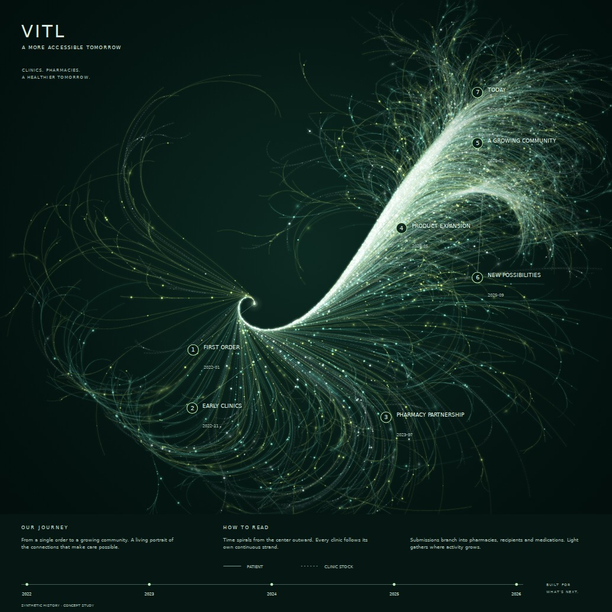

# Cowpaths

A generative-art studio for turning company history into luminous, branching strands. The VITL study uses a small curl that unfurls into a rising stream, flowing plumes, hairline paths, mint/citron light, soft depth, and a print-oriented editorial layout.



**The included history is synthetic.** Its clinics, submissions, dates, and milestones are invented for demonstration. Import an approved company export to make an actual history portrait.

## Run the studio

Use Node.js 20 or newer. The new studio has **no runtime packages and requires no install**:

```sh
npm run dev
# Open http://127.0.0.1:8080

npm test
npm run build
# Serve dist/ over HTTP on any static host.
```

The development server binds to localhost. To open it on another device, explicitly use `npm run dev -- --host 0.0.0.0`. Change its port with `--port 8081`.

The studio uses native JavaScript modules and Canvas 2D. Geometry and rendering run in a worker where OffscreenCanvas is available, with a main-thread fallback. There is no analytics, API connection, upload, remote font, or browser data persistence. Serve over HTTP; opening `index.html` as a file is not supported by module workers.

## Features

- Import a JSON history or reopen a saved project.
- Scrub the history month by month or play its growth.
- Adjust seed, branch reach, flow variation, palette, bloom, exposure, focus and depth softness.
- Toggle milestone annotations and the poster typography/legend.
- Export a square PNG at 2,048, 4,096 or 7,200 pixels. The latter is 24 × 24 inches at 300 dpi. PNG physical-density metadata is included.
- Save the validated input and settings as a versioned JSON project. Older projects retain their original flow; **Reset style** adopts the current geometry.
- Choose a submission budget. Above that budget, a deterministic sample is explicitly reported; the renderer never invents replacement submissions.

## Use your company history

Start with [the small JSON example](examples/history-small.json) and the [data guide](docs/data-format.md). **Download sample** in the studio provides the complete synthetic study.

For a CSV export shaped as one row per submission/pharmacy/recipient, use the adapter:

```sh
node scripts/import-csv.mjs examples/history-rows.csv history.local.json "VITL"
```

Import the resulting JSON in the studio. The converter replaces source clinic, pharmacy and submission keys with art-only keys, discards recipient keys, and preserves the branching counts. It derives clinic joining months from their first submission; edit `joined` if you have earlier onboarding months. It does not connect to a database or invent a production schema.

The CSV example is fictional too. The converter assumes an actual export by default; set `synthetic: true` when converting fictional data.

Keep raw exports outside this public repository. `private-data/` and `*.local.json` are ignored. Imported files do not enter a build unless manually added to a source directory.

## How to read the art

| History | Visual encoding |
| --- | --- |
| Clinic and joining month | One persistent lane, beginning at its joining month |
| Submission and month | One branch leaving that clinic at its chronological position |
| Pharmacy fulfillment | A child branch with pharmacy-dependent curvature |
| Recipient in that fulfillment | A child branch; no identity is needed |
| Medication count | One terminal branch per counted medication |
| Patient / clinic-stock shipment | Solid / dashed path cores |
| More activity | More overlapping actual trajectories and light |
| Public milestone | Numbered leader anchored to that month |

This is an artistic encoding, not a quantitative dashboard. Path length, depth, free curls, light particles and palette variation are composed rather than measured. Recipient counts describe fulfillment recipients, **not distinct patients across the company**. Grain and point lights are decorative, not additional submissions. See [rendering notes](docs/rendering.md) for the explicit limits.

## Original particle experiment

The original Three.js/curl-noise renderer, presets and controls remain in `src/script.js` and its existing supporting files.

```sh
npm ci
npm run dev:legacy
npm run build:legacy
# Legacy output: dist-legacy/ (does not overwrite the new studio)
```

The historical dependency set is preserved. The new studio does not import it. Original starter: Bruno Simon's [Three.js Journey](https://threejs-journey.xyz/).

## Verification

`npm test` runs twelve contracts covering hierarchy counts, branch attachment and departure angles, expanding clinic lanes, determinism, timeline cutoffs, sampling, medication-count changes, input rejection, current and legacy project round trips, CSV conversion and PNG density metadata.

An optional browser integration check requires a separately supplied Playwright installation and Chromium binary:

```sh
CHROMIUM_EXECUTABLE=/path/to/chromium TEST_PRINT=1 node scripts/browser-smoke.mjs
```

It checks the worker and fallback renderer, imports, invalid-file handling, project save/reopen, seed variation, mobile layout, focus view, PNG download, density metadata and the full 7,200-pixel print export. Results are saved in `artifacts/`, which is ignored by git. The committed [browser report](docs/browser-report.json) records the verification run.

## Modules

| File | Responsibility |
| --- | --- |
| `src/journey/data.mjs` | Input validation and synthetic history |
| `src/journey/scene.mjs` | Deterministic hierarchy and current geometry |
| `src/journey/scene-v1.mjs` | Original geometry for saved 1.0.0 projects |
| `src/journey/render.mjs` | Strands, light, labels and poster layout |
| `src/journey/worker.mjs` | Background rendering and PNG encoding |
| `src/journey/project.mjs` | Project format and print-density metadata |
| `src/journey/studio.mjs` | Import, controls, playback and download |
| `scripts/import-csv.mjs` | Local source-export adapter |
